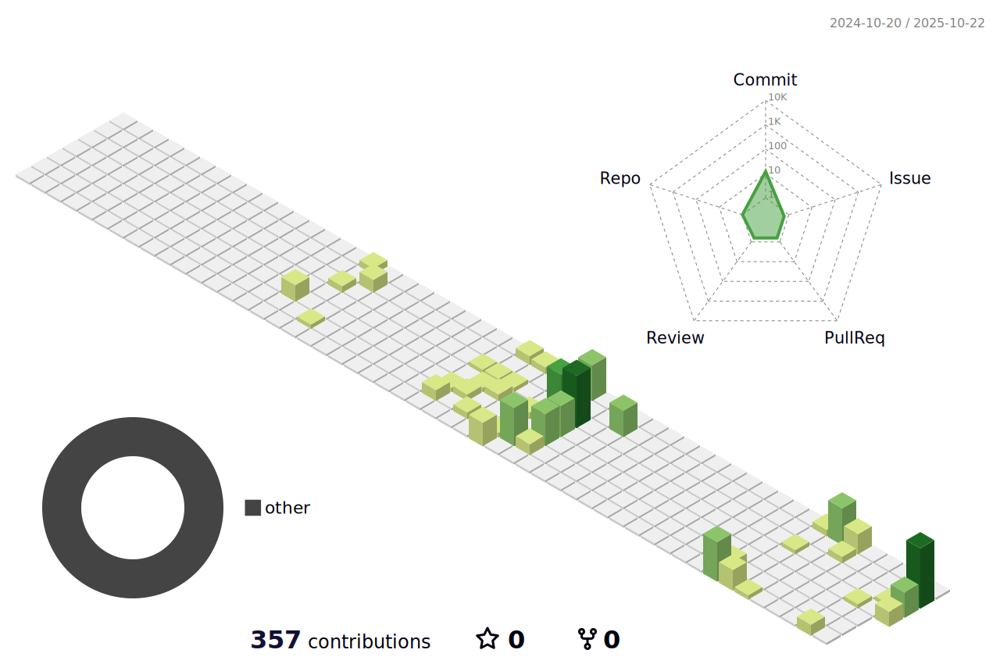

# Hello, I'm Amir 👋

  

---

## 🚀 About Me

I'm **Amir Azadmehr**, a passionate **Full Stack Developer** and **Tech Innovator** with expertise spanning multiple technologies and frameworks. With **7+ years** of experience, I've successfully delivered **50+ projects** across various industries, specializing in:

- 🐍 **Python & Django** - Building robust backend systems and APIs
- ⚛️ **React** - Creating dynamic and responsive web applications  
- 📱 **Flutter** - Developing cross-platform mobile applications
- 🔧 **Laravel** - Crafting enterprise-grade PHP solutions
- 🏢 **ERP & CRM** - Implementing business solutions with Odoo & Zoho
- 🌐 **WordPress** - Custom plugins and enterprise web solutions

---

## 🛠️ Tech Stack & Expertise

### Languages & Frameworks

### Databases & Tools

### Cloud & DevOps

---

## 💼 What I Do

### 🏗️ **Backend Development**
- **Django & Python** → RESTful APIs, microservices, data processing
- **Laravel** → Enterprise applications, custom libraries, database optimization
- **API Integration** → Third-party services, payment gateways, automation tools

### 📱 **Mobile Development**
- **Flutter** → Cross-platform apps for iOS and Android
- **Native Performance** → Optimized user experiences across devices

### 🌐 **Frontend Development**
- **React** → Modern SPAs, component libraries, state management
- **Responsive Design** → Mobile-first, accessible user interfaces

### 🏢 **Enterprise Solutions**
- **ERP Systems** → Odoo customizations, business process automation
- **CRM Solutions** → Zoho implementations, workflow optimization
- **WordPress** → Custom plugins, WooCommerce extensions, performance tuning

---

## 🌱 Currently Exploring

- 🔥 **Advanced Django patterns** and microservices architecture
- 🚀 **React Native** for enhanced mobile development
- 🤖 **AI/ML integration** with Python and Django
- ☁️ **Cloud-native** development with AWS and containerization
- 📊 **Data visualization** and analytics dashboards

---

## 🎯 Featured Projects

### 🏢 Enterprise ERP Solutions
- **Custom Odoo Modules** → Inventory management, HR automation, financial reporting
- **Multi-company Setup** → Scalable business management systems

### 📱 Mobile Applications
- **Flutter Apps** → E-commerce, social platforms, productivity tools
- **Cross-platform Solutions** → iOS and Android with shared codebase

### 🌐 Web Applications
- **Django Projects** → Content management, API services, data analytics
- **React Dashboards** → Real-time monitoring, business intelligence

---

## 🤝 Let's Connect & Collaborate

I'm always excited to work on:
- 🚀 **Challenging technical projects** that push boundaries
- 🤝 **Open source contributions** that benefit the community
- 🌍 **Remote collaborations** with teams worldwide
- 💡 **Innovative startups** looking to scale their technology

---

## 📊 3D Contribution Graph

---

## 📈 GitHub Statistics

  
  
  
  
  

